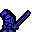

# Canvas RPG Chrome Extension

 **Canvas RPG** - A gamified task management system for Canvas LMS 

## Overview

Canvas RPG transforms your Canvas LMS experience into an exciting RPG adventure! Complete assignments, attend events, and defeat the dragon boss as you progress through your academic journey.

## Features

- **Quest System**: Canvas assignments and events appear as quests in your quest scroll
- **XP Progression**: Gain experience points by completing quests
- **Boss Battles**: Use your accumulated XP to attack the dragon boss
- **Animated Knight**: Your character performs random animations and attacks
- **Dynamic Backgrounds**: Parallax scrolling backgrounds with animated lightning effects
- **Time Challenges**: Random time-based challenges appear every 15-30 minutes
- **Challenge Rewards**: Earn bonuses like double XP, bonus loot, or critical hit chances
- **Persistent Progress**: Your game state is saved between sessions

## Installation

1. Download the extension from the Chrome Web Store (or load unpacked for development)
2. Pin the extension to your toolbar for easy access
3. Click the Canvas RPG icon to open the game interface

## Setting Up Canvas RPG

### Getting your Canvas API Token
1. Click the "Account" button on the left ribbon in Canvas (If you cannot see the left ribbon, first click the three horizontal lines in the upper left corner to reveal the menu)
2. Click on the "Settings" option
3. Scroll down to the "Approved Integrations" section
4. Click the "+ New Access Token" button
5. Enter "Canvas RPG" as the purpose and set an expiration date (or leave blank for no expiration)
6. Click "Generate Token" and copy the token that appears

### Configuring the Extension
1. Open Canvas RPG by clicking its icon in your browser toolbar
2. Click the blue "SETTINGS" button in the lower right corner
3. Enter your Canvas API Token in the appropriate field
4. Enter your Canvas domain (e.g., "yourschool.instructure.com")
5. Click the green "Save Settings" button
6. Click the grey "Back to Game" button to return to the main interface

## How to Use

### Quest Scroll
- The scroll contains quests that correspond to your Canvas assignments and events
- When you complete an assignment or attend an event, check the box next to the corresponding quest
- Completed quests award XP and disappear from your quest list

### XP System
- Gain XP by completing quests
- Your XP progress is shown in the blue bar at the top of the screen
- XP accumulates and can be used to attack the boss

### Boss Battles
- Click the red "ATTACK BOSS" button to use your XP to attack the dragon
- Each attack consumes some XP and deals a random amount of damage
- The boss's health is displayed in the red bar at the top of the screen
- Defeat the boss to level up and face stronger challenges

### Knight Character
- Your knight character  
- During attacks, the knight displays a special attack animation 
- Hover over the knight to see random dialogue messages

### Time Challenges
- Special challenges appear periodically (every 15-30 minutes)
- Each challenge offers a time frame (15, 20, 30, 45, or 60 minutes)
- Complete the challenge to earn special rewards
- Rewards include double XP, bonus loot, or critical hit bonuses

## Tips and Tricks

- Check Canvas RPG regularly to keep track of your assignments
- Use the attack button strategically to maximize damage to the boss
- Pay attention to time challenges for bonus rewards
- Complete quests before their due dates for the best experience

## Troubleshooting

If you encounter issues:
- Ensure your Canvas API token is entered correctly
- Check that your Canvas domain is correct
- Try refreshing the extension by closing and reopening it
- Clear your browser cache if problems persist

Canvas RPG was created to make academic task management more engaging and fun.

Enjoy your adventure in Canvas RPG!
